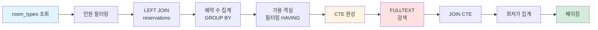

# 숙소 검색 기능 리팩토링: 예약 가능 여부 통합

## 개요

기존 FULLTEXT INDEX 기반 키워드 검색에 **체크인/체크아웃 날짜**와 **숙박 인원** 조건을 추가하여, 실제 예약 가능한 숙소만 검색 결과로 제공합니다.

### 아키텍처 개요


## 1. 요구사항 정의

### 1.1 검색 조건

사용자가 입력하는 검색 조건:

- **keyword**: 숙소명 또는 지역 (FULLTEXT INDEX 사용)
- **checkIn**: 체크인 날짜
- **checkOut**: 체크아웃 날짜
- **capacity**: 숙박 인원 수

### 1.2 검색 결과

예약 가능한 숙소 정보:

- 숙소 기본 정보 (이름, 설명, 주소, 썸네일)
- 예약 가능한 객실 타입 정보
    - 객실 타입명, 가격, 수용 인원
    - 예약 가능한 객실 수
- 최저가 정보

## 2. 데이터베이스 설계

### 2.1 현재 테이블 구조


**주요 관계**

- 1개 숙소(Accommodation)는 여러 객실 타입(RoomType)을 가질 수 있음
- 1개 객실 타입(RoomType)은 여러 실제 객실(RoomUnit)을 가질 수 있음
- 예약(Reservation)은 객실 타입(RoomType) 단위로 생성됨

### 2.2 예약 테이블 설계

#### 2.2.1 예약 프로세스 개념

```
1. 예약 생성 (reservations)
   - 고객이 객실 타입(room_type)을 선택하여 예약
   - room_type_id 기준으로 저장
   
2. 예약 확정 (reservation_confirmations) - 향후 구현
   - 결제 완료 후 예약 확정
   - 실제 객실(room_unit) 배정 (공급자가 체크인 시점에 배정)
   
3. 체크인 처리
   - 배정된 room_unit으로 입실
```

**설계 의도**

- **예약 단계 분리**: 예약 생성과 확정을 분리하여 히스토리 관리
- **유연한 객실 배정**: 체크인 시점에 공급자가 가용한 객실 배정 가능
- **검색 성능**: room_type_id 기준으로 집계하여 쿼리 단순화

#### 2.2.2 예약 테이블 (현재 - 검색 기능용)

```sql
CREATE TABLE reservations
(
    id           BIGINT PRIMARY KEY AUTO_INCREMENT,
    room_type_id BIGINT NOT NULL, -- room_types.id 참조 (예약은 타입 단위로)
    check_in     DATE   NOT NULL,
    check_out    DATE   NOT NULL,
    created_at   DATETIME DEFAULT NOW(),
    updated_at   DATETIME DEFAULT NOW() ON UPDATE NOW(),

    INDEX idx_room_type_dates (room_type_id, check_in, check_out),
    FOREIGN KEY (room_type_id) REFERENCES room_types (id)
) ENGINE = InnoDB
  DEFAULT CHARSET = utf8mb4;
```

**현재 단계 목적**

- 검색 기능 구현 (예약 가능한 객실 타입 필터링)
- 실제 예약 생성 기능 개발 시 확장 예정

#### 2.2.3 예약 확정 테이블 (향후 구현)

```sql
CREATE TABLE reservation_confirmations
(
    id             BIGINT PRIMARY KEY AUTO_INCREMENT,
    reservation_id BIGINT      NOT NULL, -- reservations.id
    room_unit_id   BIGINT      NOT NULL, -- 실제 배정된 객실
    user_id        BIGINT      NOT NULL, -- 예약자
    status         VARCHAR(30) NOT NULL, -- CONFIRMED, CHECKED_IN, CHECKED_OUT, CANCELLED
    payment_id     BIGINT      NULL,     -- 결제 정보
    confirmed_at   DATETIME    NOT NULL,
    created_at     DATETIME DEFAULT NOW(),
    updated_at     DATETIME DEFAULT NOW() ON UPDATE NOW(),

    INDEX idx_reservation (reservation_id),
    INDEX idx_room_unit_dates (room_unit_id, confirmed_at),
    FOREIGN KEY (reservation_id) REFERENCES reservations (id),
    FOREIGN KEY (room_unit_id) REFERENCES room_units (id),
    FOREIGN KEY (user_id) REFERENCES users (id)
) ENGINE = InnoDB
  DEFAULT CHARSET = utf8mb4;
```

**향후 확장 시 장점**

- 예약 상태 변경 히스토리 추적 가능
- 객실 배정 이력 관리
- 예약 취소/변경 시 원본 데이터 유지

### 2.3 인덱스 전략

**1) FULLTEXT INDEX (기존)**

```sql
FULLTEXT INDEX ft_idx_name_address (name, address) WITH PARSER ngram
```

- 키워드 검색 최적화
- 성능: LIKE 대비 20~100배 향상

**2) 예약 날짜 인덱스 (신규)**

```sql
INDEX idx_room_type_dates (room_type_id, check_in, check_out)
```

- 특정 객실 타입의 예약 기간 검색 최적화
- 예약 겹침 확인 성능 향상
- room_type_id 기준으로 예약을 집계하여 쿼리 단순화

## 3. 검색 로직 설계

### 3.1 검색 프로세스 플로우

> **성능 비교:** 실행 시간 0.17ms (CTE) vs 0.685ms (서브쿼리)  
> CTE를 사용하여 가독성과 성능을 모두 확보, 데이터가 늘어나면 서브쿼리가 더 빨라질 수 있어서 

#### 3.1.1 전체 쿼리 구조

```sql
-- [1단계] 예약 가능한 객실 타입 필터링 (CTE)
WITH available_rt AS (SELECT rt.accommodation_id, rt.base_price, COUNT(r.id) as booked_count, rt.total_room_count
                      FROM room_types rt
                               LEFT JOIN reservations r ON (
                          r.room_type_id = rt.id
                              AND r.check_in < :checkOut
                              AND r.check_out > :checkIn
                          )
                      WHERE rt.standard_capacity <= :capacity
                        AND rt.max_capacity >= :capacity
                      GROUP BY rt.id, rt.accommodation_id, rt.base_price, rt.total_room_count
                      HAVING booked_count < rt.total_room_count)

-- [2단계] 최종 숙소 검색 및 최저가 집계
SELECT a.id, a.name, a.address, a.thumbnail, MIN(available_rt.base_price) AS min_price
FROM accommodations a
         JOIN available_rt ON a.id = available_rt.accommodation_id
WHERE a.is_visible = true
  AND MATCH(a.name, a.address) AGAINST(:keyword IN NATURAL LANGUAGE MODE)
GROUP BY a.id, a.name, a.address, a.thumbnail
LIMIT :limit OFFSET :offset
```

#### 3.1.2 쿼리 실행 단계



#### 3.1.3 처리 로직

```
1. 모든 객실 타입에서 capacity 조건 충족하는 것만 필터링
   WHERE rt.standard_capacity <= :capacity AND rt.max_capacity >= :capacity
   ↓
2. 각 객실 타입별로 예약된 수 계산
   LEFT JOIN reservations로 해당 기간 예약 집계
   COUNT(r.id)로 예약 수 계산
   ↓
3. 예약 가능한 객실 타입만 필터링
   HAVING booked_count < rt.total_room_count
   결과를 available_rt CTE에 임시 저장
   ↓
4. FULLTEXT INDEX로 키워드 매칭 숙소 조회
   MATCH(a.name, a.address) AGAINST(:keyword)
   ↓
5. 숙소와 가용 객실 타입 조인
   JOIN available_rt ON a.id = available_rt.accommodation_id
   ↓
6. 숙소별 최저가 계산 및 결과 반환
   MIN(available_rt.base_price)
   LIMIT :limit OFFSET :offset
```