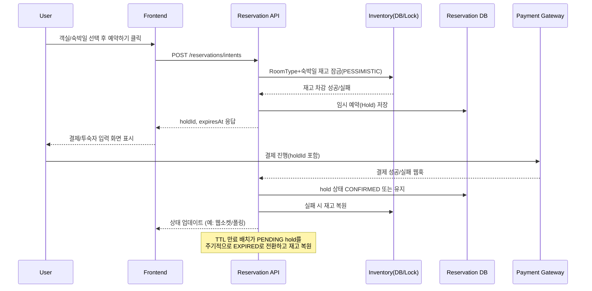
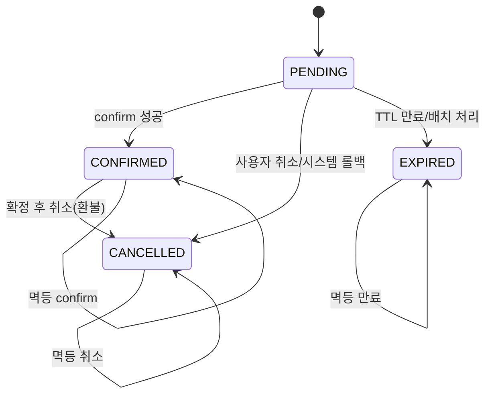

# 임시 예약 (Provisional Reservation)

## 1. 목적

- 예약하기 버튼 클릭 시 사용자의 객실 점유 의사를 즉시 기록하고, 결제 완료 전까지 재고가 다른 사용자에게 넘어가지 않도록 보장한다.
- 확정 이전 단계의 상태를 명시해 사용자 경험(확정 후 취소)과 파트너 SLA 위반을 예방한다.
- 임시 예약과 본 예약을 분리해 결제/외부 연동 장애 시에도 재시도·만료 처리가 가능한 구조를 만든다.

## 2. 사용자 여정 요약

1. 사용자가 숙소 상세에서 객실·숙박일·인원을 선택하고 `예약하기`를 누른다.
2. 서버는 최신 재고를 조회하고, 재고가 충분하면 임시 예약(hold)을 생성해 TTL과 함께 저장한다.
3. 프론트는 hold 식별자를 받아 결제/투숙자 정보 입력 화면으로 이동한다.
4. 결제 성공 시 `confirm` 요청을 보내 hold를 확정 예약으로 전환한다.
5. 사용자가 취소하거나 TTL이 만료되면 hold를 정리하고 재고를 복원한다.

## 3. 기능 요구사항

- `POST /reservations/intents` (가칭) 호출로 임시 예약을 생성하고 hold 식별자, 만료 시각을 응답한다.
- 임시 예약 생성 시 다음 정보를 저장한다: `userId`, `roomTypeId`, `checkIn`, `checkOut`, `capacity`, 요금 스냅샷, `status`, `expiresAt`.
- 재고는 RoomType+숙박일 단위로 관리하며, 임시 예약이 생성되면 즉시 남은 재고를 감소시킨다.
- `POST /reservations/{holdId}/confirm` 호출로 결제 성공을 전달하면 상태를 `CONFIRMED`로 전환하고 본 예약 엔티티와 연결한다.
- `DELETE /reservations/{holdId}` 또는 TTL 만료 시 `CANCELLED/EXPIRED` 상태로 전환하고 재고를 복구한다.
- 사용자별 진행 중 hold 목록을 조회할 수 있도록 `GET /reservations/intents?status=PENDING` API를 제공한다.

## 4. 비기능 요구사항

- 동시성: 동일 RoomType+기간에 대한 다중 요청을 안전하게 직렬화해야 한다.
- 성능: 임시 예약 생성 API는 200ms 이내 응답을 목표로 하며, 락 점유 시간을 최소화한다.
- 가용성: TTL 만료 배치 실패 시에도 재시도 가능해야 하며, 중복 만료 처리를 허용하는 멱등성을 유지한다.
- 감사 추적: hold 생성/확정/만료 이벤트를 로깅해 CS 및 SLA 분쟁에 대비한다.

## 5. 데이터 및 상태 모델

| 컬럼                                 | 설명                                             |
|------------------------------------|------------------------------------------------|
| `hold_id` (PK)                     | 임시 예약 식별자(UUID)                                |
| `room_type_id`                     | 객실 타입 FK                                       |
| `check_in`, `check_out`            | 숙박일 범위                                         |
| `capacity_adult`, `capacity_child` | 투숙 인원                                          |
| `rate_snapshot`                    | 요금/세금 정보 JSON                                  |
| `user_id`                          | 예약 시도 사용자 ID                                   |
| `status`                           | `PENDING`, `CONFIRMED`, `CANCELLED`, `EXPIRED` |
| `expires_at`                       | hold 만료 시각                                     |
| `created_at`, `updated_at`         | 감사용 타임스탬프                                      |
| `last_event`, `metadata`           | 결제/세션 정보 등 운영 추적용                              |

재고는 별도의 `room_type_inventory` (일자별 수량) 테이블에서 관리하며, hold 레코드는 해당 인벤토리 Row와 연동된다.

## 6. 동시성 및 락 전략

- RoomType+숙박일 단위 재고 Row에 **비관적 락(PESSIMISTIC_WRITE)**을 적용해 남은 수량을 감소시킨다.
- 낙관적 락은 재시도 비용이 폭증하고, NamedLock은 추가 인프라 구성이 필요하므로 현 단계에서는 보류한다.
- 락 획득 후 수행 순서: 재고 검증 → 수량 감소 → hold 레코드 삽입 → 트랜잭션 커밋.
- 트랜잭션을 짧게 유지하기 위해 hold 생성에 필요한 검증/계산을 사전에 끝내고, 재고 락 이후에는 데이터베이스 작업만 수행한다.

## 7. TTL 및 만료 배치

- 기본 TTL: 예) 5분. `expires_at`은 hold 생성 시점 + TTL로 저장한다.
- 배치 작업은 `status = 'PENDING' AND expires_at < now()` 조건을 주기적으로 스캔해 `EXPIRED`로 전환하고 재고를 복원한다.
- 배치와 실시간 처리 모두 멱등하게 동작하도록 업데이트 조건에 상태를 명시(`WHERE status = 'PENDING'`).
- 배치 실패 대비를 위해 작업 결과를 로깅하고, 재시도 시 중복 만료 처리에 문제가 없도록 재고 복원 로직도 멱등하게 구현한다.

## 8. 실패/예외 시나리오

- **결제 실패**: hold 상태는 유지하되 만료 시각까지 사용자에게 재시도 기회를 제공하거나 즉시 취소 옵션을 제공한다.
- **사용자 취소**: 명시적 취소 API로 상태를 `CANCELLED`로 전환하고 재고 복원.
- **시스템 장애**: hold 생성 중 예외 발생 시 트랜잭션 롤백으로 재고 일관성을 유지한다. 만료 배치 중 장애 시 다음 실행에서 다시 처리한다.
- **동시 확정 요청**: `status = PENDING` 조건을 가진 `UPDATE`로 단 한 번만 `CONFIRMED` 상태가 되도록 방어한다.

## 9. 결정 근거 및 트레이드오프

- 숙박 도메인은 객실 수가 제한적이므로 “무제한 재고 가정 후 사후 취소” 방식은 사용자 신뢰와 파트너 SLA에 큰 손실을 준다.
- 임시 예약 + 비관적 락 방식은 구현 복잡도가 있지만, 예약 확정 전에 재고를 점유함으로써 가장 중요한 UX(확정 후 취소 방지)를 달성한다.
- 낙관적 락은 충돌 빈도가 낮은 환경에서만 효과적이고, NamedLock/Redis는 추가 운영 비용이 커서 현 단계 요구사항에 과하다.
- TTL과 만료 배치를 두어 “재고가 영구 잠기는” 상황을 예방하고, hold 데이터는 이후 장애 분석에도 활용할 수 있다.

## 10. 오픈 이슈

- TTL 기본값과 연장 정책(사용자 입력 지연 시 추가 확보 여부).
- 멀티 객실 동시 예약(한 번에 두 개 RoomType)을 허용할지 여부 및 락 순서 정의.
- 결제 시스템 연동 방식(동기/비동기)과 confirm API 멱등 토큰 도입 여부.
- hold 레코드를 본 예약 테이블로 이동할지, 상태 전이만으로 관리할지에 대한 최종 결정.

## 11. 상태 전이 정의

- 상태 머신은 FSM 도입 전이라도 아래 전이만 허용하도록 서비스/리포지토리 계층에서 강제한다.
- `PENDING`만 재고를 점유하며, 다른 상태는 재고 복원 후 종료 상태로 유지한다.

| From      | To        | 조건/비고                         |
|-----------|-----------|-------------------------------|
| PENDING   | CONFIRMED | 결제 및 검증 성공. 다른 상태로 되돌릴 수 없음.  |
| PENDING   | CANCELLED | 사용자 취소/결제 실패. 재고 복원 후 종료.     |
| PENDING   | EXPIRED   | TTL 만료(배치/실시간). 이후 재확정 불가.    |
| CONFIRMED | CANCELLED | 환불 등 예외 케이스. 그 외 전이는 허용되지 않음. |
| CANCELLED | -         | 추가 전이 없음(종단).                 |
| EXPIRED   | -         | 추가 전이 없음(종단).                 |

> 규칙: `CONFIRMED`는 다시 `PENDING`이나 `EXPIRED`로 돌아갈 수 없으며, `CANCELLED`·`EXPIRED`는 종단 상태로만 유지한다.
